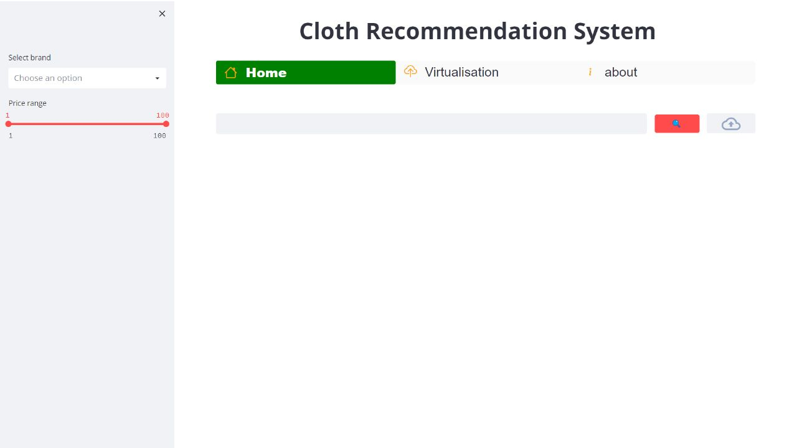
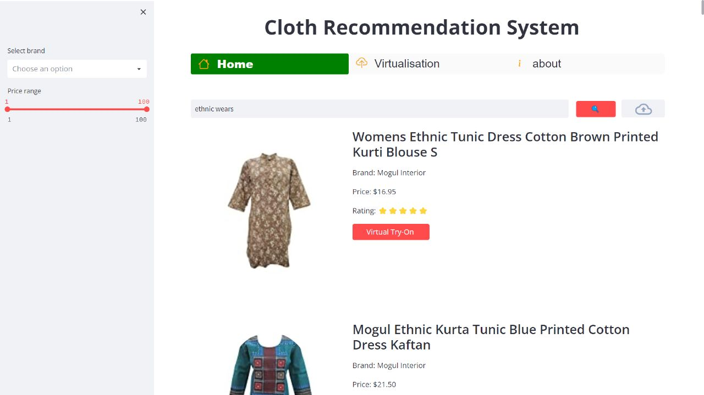
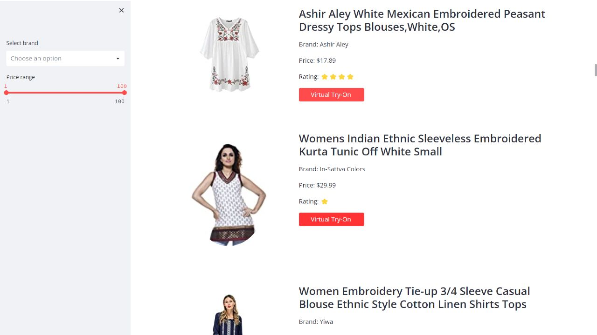
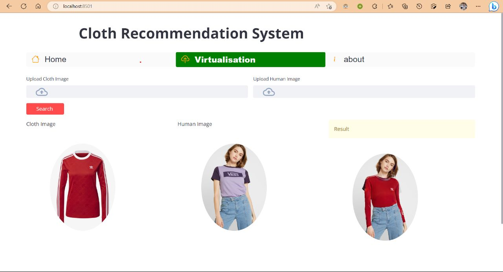

# DressMate

Fashion is a significant aspect of people's lives, and with the rise of e-commerce, customers have access to numerous clothing options. However, the sheer volume of products available online can be overwhelming, making it difficult for customers to find their ideal outfits. Our project proposes a personalized clothing recommendation system that uses ResNet50 and Pinecone to process images from the Amazon Women Top Fashion dataset and generate accurate recommendations for the user. Unlike conventional systems, which rely on the user's purchase history, our system allows users to input an image of a product they are interested in to generate recommendations based on similar visual features. The inclusion of a virtual try-on feature, powered by HrViton and Flask API, also increases user confidence in their purchasing decisions.

## Introduction

In the era of e-commerce, fashion industry is witnessing a significant shift in the way customers shop. However, with a plethora of options available on online fashion platforms, customers often face difficulties in identifying their preferred outfit. Therefore, in this project, we propose a personalized clothing recommendation system that utilizes neural networks to process product images from the Amazon Women's Fashion dataset and generate recommendations based on visual similarities. Additionally, we integrate a virtual try-on feature to enhance user confidence in purchasing decisions.

##  Proposed methodology

In this project, we have developed a personalized Clothing Recommendation System that includes a Virtual Try-On feature. Our system uses a ResNet50 model for feature extraction and Pinecone for vector searches to quickly and accurately recommend similar clothing items based on their visual features. We have also integrated the HrViton model with our Flask API to provide users with a virtual try-on experience. Our system analyzes product titles and descriptions for matching patterns and recommends products based on user preferences.


## Training the neural networks

Once the data is pre-processed, the neural networks are trained using transfer learning from ResNet50. Additional layers are added to the last few layers of the network to fine-tune the model to the current task of virtual try-on. The ResNet50 architecture, shown in the figure, serves as a strong base for the model's feature extraction capabilities.

To optimize the performance of the network, we experimented with different hyperparameters and loss functions. We used the Adam optimizer with a learning rate of 0.0002, and trained the network for 100 epochs. We also used a combination of L1 and adversarial loss functions to ensure that the generated images were both realistic and accurately represented the target clothing item. Additionally, we implemented a perceptual loss function, which helped to preserve important features in the input image while also ensuring that the generated output was visually pleasing.

Through this approach, we were able to achieve state-of-the-art results on the high-resolution HR-VITON dataset, demonstrating the effectiveness of our approach for image-based virtual try-on. Our optimized network architecture and training methodology can be applied to a variety of virtual try-on applications, enabling more accurate and realistic clothing simulations.


## Getting the inventory

The images from Amazon women fashion Dataset. The 
inventory is then run through the neural networks to classify and generate embeddings and the output 
is then used to generate recommendations. The Figure shows a sample set of inventory data


### Dataset Link

[Model Folder](https://drive.google.com/drive/folders/1bPBVRwUHTPhJlj7C2D_EtzAqJXnqM-Ci?usp=share_link)

[DataSet](https://drive.google.com/file/d/18_qpMawlFJNwwohS-X4wrgVBQWwYz1sU/view?usp=share_link)

## Screenshots

### Simple App UI



### recomended Outfits generated by our approach for the given input 






## virtualisation



## Installation

Use pip to install the requirements.

~~~bash
pip install -r requirements.txt
~~~

## Usage

To run the web server, simply execute streamlit with the main recommender app:

```bash
streamlit run Home.py
```

## Built With
For my virtual try-on project, I used a variety of powerful open-source libraries and tools to preprocess and analyze data, build and train neural networks, and create a user-friendly app interface. Some of the key technologies I used include:

- [OpenCV](https://opencv.org/) - OpenCV is a powerful computer vision and machine learning library that provides a wide range of image processing and analysis tools. I used it extensively in my project to preprocess and manipulate images, detect and extract features, and more.

- [Tensorflow](https://www.tensorflow.org/) - TensorFlow is a popular machine learning platform that offers a wide range of tools and features for building and training neural networks. I used it in conjunction with transfer learning from the ResNet50 architecture to fine-tune the network model for virtual try-on.

- [Tqdm](https://tqdm.github.io/) - Tqdm is a simple yet powerful library for displaying progress bars in Python. I used it extensively in my data processing pipeline to monitor the progress of various operations.

- [Streamlit](https://streamlit.io/) - Streamlit is a cutting-edge app framework for creating interactive data science and machine learning apps. I used it to create a user-friendly interface for my virtual try-on application, allowing users to easily upload images and view the results of the model.

- [Pandas](https://pandas.pydata.org/) - Pandas is a popular data analysis and manipulation library for Python. I used it to load and manipulate various data sets used in my project, including the HR-VITON dataset.

- [Pillow](https://pillow.readthedocs.io/en/stable/) - Pillow is a powerful image processing library for Python that provides a wide range of tools for image manipulation, filtering, and more. I used it in conjunction with OpenCV to preprocess and manipulate images throughout my project.

- [scikit-learn](https://scikit-learn.org/stable/) - Scikit-learn is a popular machine learning library that provides a wide range of tools and algorithms for classification, regression, clustering, and more. While I didn't use it extensively in my virtual try-on project, it remains a powerful tool for many other machine learning applications.

- [opencv-python](https://pypi.org/project/opencv-python/) - OpenCV-Python is a Python wrapper for the OpenCV library. I used it in conjunction with the main OpenCV library to build and train neural networks, preprocess and manipulate images, and more.
